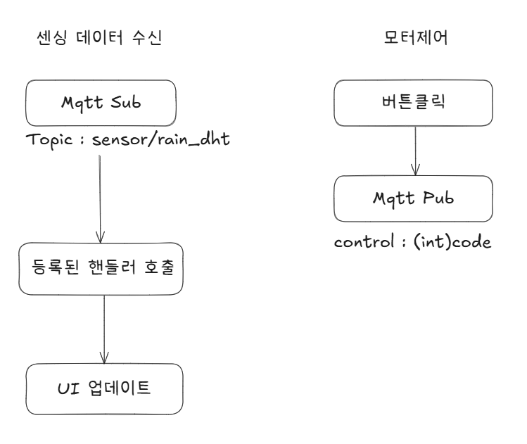

# Qt6 GUI APP
터치 디스플레이 지원 GUI APP 입니다.

# 개요

모든 시스템을 연동하여 사용자가 사용할 수 있게끔 하는 GUI APP 입니다.


- 기능 설명

    - 좌측 3개의 버튼 
        - UP : 창문을 위로 올립니다. (닫습니다.)
        - STOP : 모터 가동을 멈춥니다.
        - DOWN : 창문을 아래로 내립니다. (열립니다.)

    - 중앙 UI
        - 현재 차량내부의 온도 및 습도를 표시합니다.
    
    - 우측 UI
        - 주차 등 자리를 비운 사이 비가 감지되었을때, 자동으로 창문이 닫힌 기록이 로그로 남습니다.
    
    - 상,하단 바
        - 상단 : 현재 시각을 나타냅니다, 추후 기능 확장시 실제 차량 UI처럼 다른 정보를 표시할 수 있습니다.
        - 하단 : 모터의 상태를 나타냅니다, 이 또한 기능 확장시 다른 정보를 추가 할 수 있습니다.


## 개발

개발 환경은 라즈베리파이4 내부에 `Qt6`를 설치하고, Windows 데스크톱에서 `VScode Remote SSH` 를 활용하여 원격 개발하였습니다. `CMake`를 도입하여 플랫폼 간의 호환성과 유지보수성을 높였습니다.
추후 확장을 염두해둔 선택입니다.




## CMake 빌드 관련

- 이전 CMakeCache 삭제 후 빌드
    ```bash
    rm -rf build/
    cmake -Bbuild -S. -DCMAKE_PREFIX_PATH="/usr/local/lib/cmake"
    # 혹은
    cmake -B . -S build
    cmake -B . -S build --fresh # 캐시 삭제 버전
    ```

- 빌드
    ```bash
    cmake -build build
    ```

## paho-mqtt 환경설정 (CMake)

1. 의존성 설치

    ```bash
    sudo apt update
    sudo apt install git cmake build-essential libssl-dev
    ```

2. paho.mqtt.c (C 라이브러리) 빌드 및 설치

    ```bash
    git clone https://github.com/eclipse/paho.mqtt.c.git
    cd paho.mqtt.c

    cmake -Bbuild -DPAHO_BUILD_STATIC=TRUE -DPAHO_BUILD_SHARED=TRUE
    cmake --build build/ -- -j$(nproc)

    sudo cmake --install build
    ```

3. paho.mqtt.cpp (C++ 라이브러리) 빌드 및 설치

    ```bash
    git clone https://github.com/eclipse/paho.mqtt.cpp.git
    cd paho.mqtt.cpp

    cmake -Bbuild -H. \
    -DPAHO_BUILD_STATIC=TRUE \
    -DPAHO_BUILD_SHARED=TRUE \
    -DPAHO_MQTT_C_PATH=/usr/local

    cmake --build build/ -- -j$(nproc)
    sudo cmake --install build
    ```

4. 설치 확인

    ```bash
    # 헤더
    ls /usr/local/include | grep MQTT

    # 라이브러리
    ls /usr/local/lib | grep paho

    # cmake 설정
    ls /usr/local/lib/cmake/eclipse-paho-mqtt-c
    ls /usr/local/lib/cmake/paho-mqttpp3
    ```