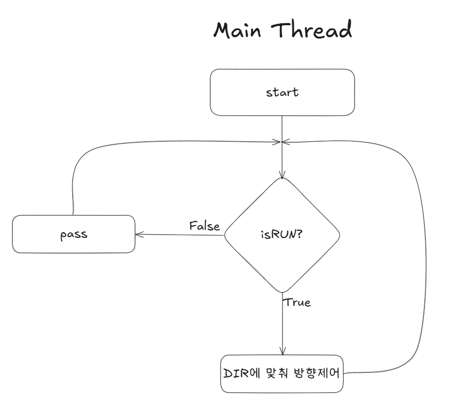
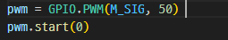

# MotorController
Mqtt 통신을 통해 control 신호를 받아 서보모터를 제어하는 프로그램 입니다.
모터 제어에는 Python RPi.GPIO 라이브러리를 사용했습니다.

## 개요

Oper Code 정의

|CODE|command|
|:--:|:--:|
|1|to 180 (UP)|
|0|STOP|
|-1|to 0 (DOWN)|
|2|Rain_Start|
|3|Rain_End|

## 동작 방식

- 메인 스레드 동작 흐름도
    
    

- 백그라운드 스레드 동작 흐름도 (Mqtt Subscriber)
    
    

---

- 실제 구현

    - 메인 : 전역변수 TARGET_ANGLE 및 time.sleep 을 통하여 과부화를 피하기 위한 안정적인 코드를 지향했습니다.

        

    - MQTT 메시지 핸들링 : 백그라운드 스레드와 메인스레드의 역할분리를 위해서 메시지 수신시 방향과 동작여부만 설정해주고 실제 실행은 메인 스레드가 판단하게끔 설계하였습니다. 

        

## 모터 연결
- 데이터시트

    

- PWM 세팅

    
    - PWM Period : 20ms(50Hz) 에 맞추어 설정해주었습니다.

- 전원 연결

    
    - 5V의 전원을 현재 사용중인 파이4에서 공급하려고 시도하였으나, 불안정한 동작
    - 현재 7인치 디스플레이 및 아두이노에게 전원을 공급중이기 때문에 외부전원을 선택
    - USB A to 점퍼(암) 케이블을 활용하여 모터의 전원을 공급했습니다.

## 실행

- Default (STOP)

    

- UP버튼 클릭시
    
    

- DOWN버튼 클릭시

    

## 여담

> DC모터를 사용해서 실제 자동차의 창문 시스템을 유사하게라도 구현해보고 싶었다.
>
> 현재 임베디드 리눅스 환경에 대한 학습의 목적이 더 큰 관계로
> 보유중인 모터가 서보모터 뿐이라, 빠른 구현을 위해 서보모터를 사용했지만, 
> 추후 DC모터와 윈도우리프터, 감속기어 등 제대로 장비를 갖추고 리팩토링해볼 예정이다.
